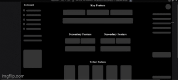

# Modern Layout 1
This is a modern, responsive layout template created using HTML and CSS. It features a clean, minimalistic design with flexible 
columns that adjust for different screen sizes. The layout is divided into three main sections: left, middle, and right. Each section has been 
carefully structured to provide an efficient, organized, and aesthetically pleasing design that adapts seamlessly to various devices.

**Link to project:** https://modernlayoutone.netlify.app/

    

## How It's Made: 

**Tech used:** HTML & CSS
I used the whiteboard technique and inspiration from other projects I've seen to create a static page, no content, just the template. I got to practice using flexbox and seeing different circumstances 
to use features such as gap, justify-content, align-content, as well as flex-direction and the effect it can have on the previously mentioned attributes. When I was building the html it was so much easier to use a 
whiteboard to draw a rough draft and then sort everything in boxes and then boxes inside of those boxes to really visualize structure. This envisionment allowed for me to think about the CSS I would need
and encouraged a repetitive design that allowed for CSS to be reused across sections. The use of flex-box made this project responsive to different screen sizes thanks mostly to flex-wrap.

## Optimizations
I can admit I'm not happy that I had to use a media query to center the bottom section when viewed on smaller screens, as well as the "Tertiary Features" cards. There are also some cases where I repeated CSS,
with more time, I could potentially sit down and catch some of the repeats and organize it better so that some things only need to be written once. I also did not add any sort of engagement in the UI for users, 
I neglected to add any hover effects, buttons, highlights, shadows, there is much left to be desired.

## Lessons Learned
I learned more about flex-box and different aspects I can use on the containers as well as the children inside. I also discovered short cuts when creating elements in html, for example, 'ul#coolStuff>li*5' will give you 
a list with the ID of coolStuff and 5 li inside. A simple trick but over the may hours spent on a project, every second counts and adds up over time. I also really enjoyed learning and using root to create uniform spacing
and sizing across the entire template.
